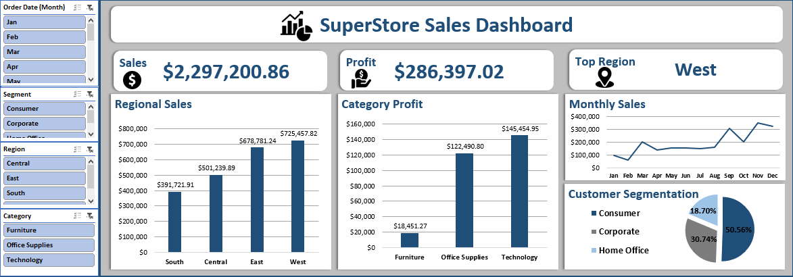

# Sales Analysis Dashboard | Microsoft Excel

## 📊 Project Overview

An interactive Sales Analysis Dashboard developed as part of the **Digital Egypt Pioneers Initiative (DEPI)**.

The project focuses on analyzing sales performance and transforming raw business data into clear and actionable insights using Microsoft Excel.

## 🎯 Objective

The main objective of this project was to analyze sales data and provide a clear overview of:

- Regional sales performance
- Category profitability
- Customer segments
- Monthly sales trends
- Overall business performance

## 🛠️ Tools & Technologies

- Microsoft Excel
- Power Query
- Pivot Tables
- Pivot Charts
- Slicers

## 🧹 Data Preparation

Power Query was used to prepare the dataset for analysis, including:

- Handling missing values
- Correcting data types
- Removing duplicates
- Transforming and organizing the data

## 📈 Analysis & Dashboard

Pivot Tables were used to analyze different aspects of the business, while Pivot Charts were used to visualize the results.

The final dashboard combines key KPIs, charts, and interactive slicers into a single-page management dashboard.

## 📷 Dashboard Preview

## 💡 Key Skills Demonstrated

- Data Cleaning
- Data Analysis
- Data Visualization
- Dashboard Design
- Microsoft Excel
- Power Query
- Pivot Tables & Charts
- Business Insights

## 🎓 Program

**Digital Egypt Pioneers Initiative (DEPI)**  
Data Analysis Track | 2026
